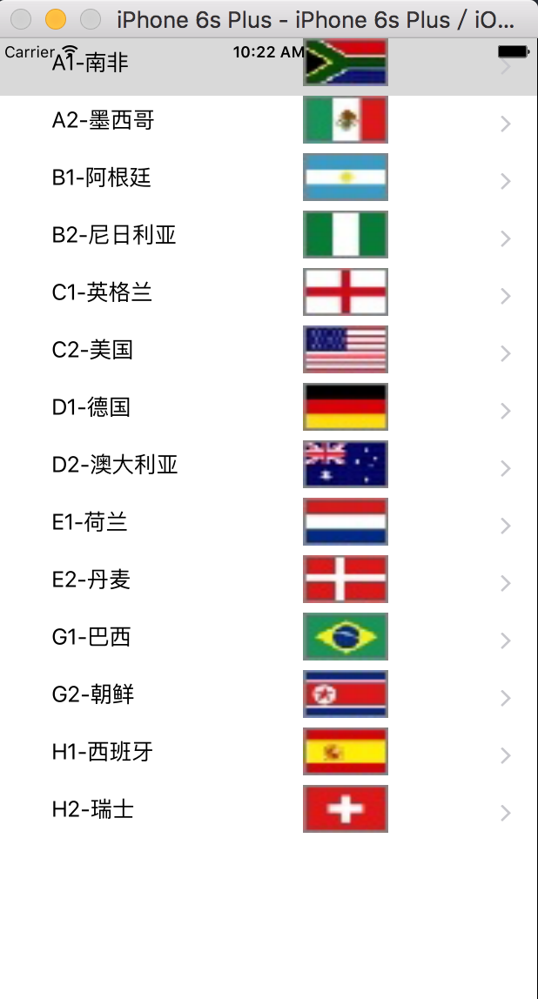

# iOSCustomTableViewCellSample

简单实现自定义TableView单元格, 基于语言Swift2.2,环境 XCode7.3.1

###运行截图：

###实现要点：
* 自定义单元格类CustomCell类；
* 实现UITableViewDataSource协议tableView:numberOfRowsInSection方法（确定表视图单元格的个数）；
* 实现UITableViewDataSource协议tableView:cellForRowAtIndexPath方法（用于为表视图单元格提供显示数据）；

喜欢的话，欢迎**Star**一下
